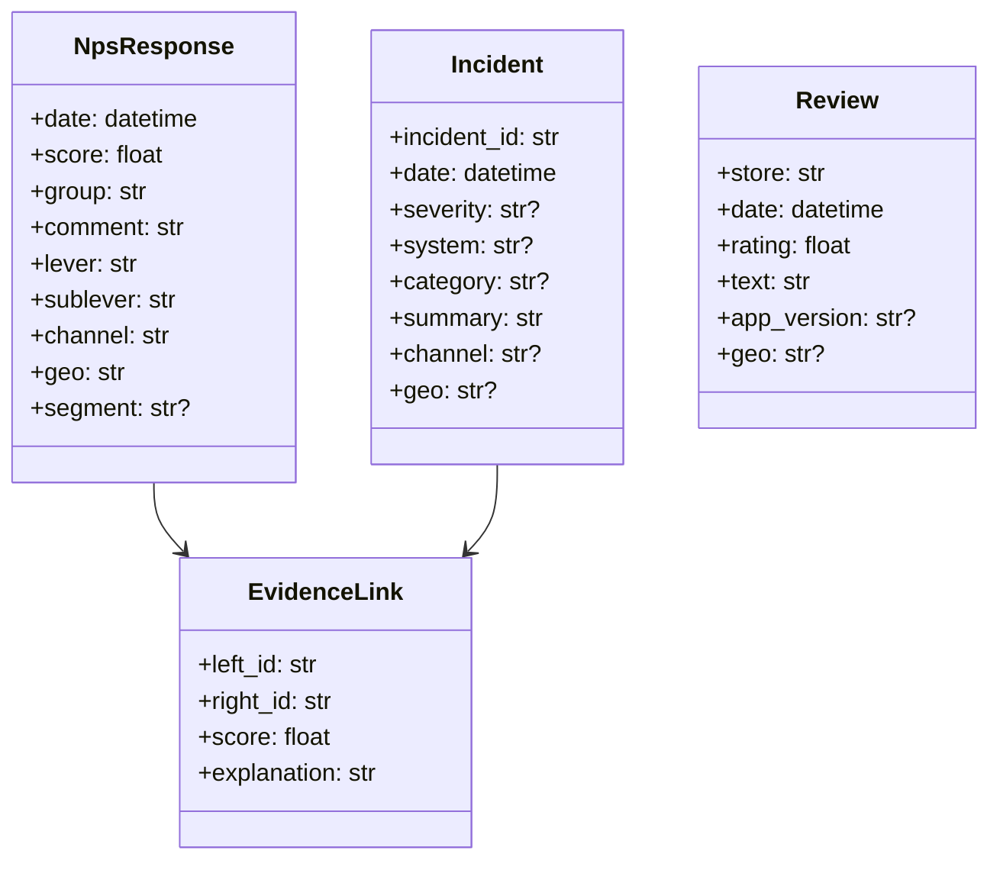

# Contratos de datos (Fuentes) y modelo canónico

Este documento define:
- columnas mínimas por Fuente
- normalización
- validación
- modelo canónico (entidades) para análisis multi‑fuente

---

## 1) Fuente: NPS Térmico (Excel)

### Columnas mínimas esperadas
- `Fecha` (o equivalente; se normaliza a `Fecha`)
- `ID` (si existe; recomendable)
- `NPS` (score numérico 0-10; se conserva el nombre histórico de columna)
- `NPS Group` (Promotor/Pasivo/Detractor) o derivable; en UI/reportes se etiqueta como `Grupo Score`
- `Comment` (texto)
- `Canal`
- `Palanca`
- `Subpalanca`
- Opcionales: `Segmento`, `UsuarioDecisión`, etc.

### Normalización
- `Fecha` → datetime naive
- strings → `str.strip()` + normalización ligera
- columnas de control internas:
  - `_text_norm`
  - `_service_origin_n2_key`

### Semántica de negocio
- `Score` = valor 0-10 individual o media 0-10.
- `NPS clásico` = `% promotores - % detractores`.
- `NPS térmico` = fuente/dominio. No se renombra destructivamente la columna `NPS` para mantener compatibilidad de ingesta y tests.
- El filtro `Canal` se calcula desde `Canal`; por defecto usa `Web` si existe y `Todos` si no.

### Taxonomía temporal oficial
- `historical_previous`: histórico anterior al inicio del Period Container. No muestra deltas.
- `current_period`: rango seleccionado en el Period Container. Sus KPIs son agregados de todas las respuestas del período, no snapshots diarios.
- `cumulative_to_current`: histórico anterior + período actual hasta el último día disponible del Period Container. No muestra deltas por defecto.
- `internal_period_evolution`: serie/bordes internos del período, usada solo para explicar evolución diaria o inicio-fin.

El `NPS clásico` ejecutivo se calcula siempre sobre el conjunto agregado de respuestas correspondiente: `(% promotores - % detractores) * 100`, con promotores `score >= 9`, pasivos `7 <= score <= 8` y detractores `score <= 6`. La serie diaria se usa para gráficos de evolución, no para sustituir KPIs agregados.

---

## 2) Fuente: Incidencias Helix (Excel)

### Columnas típicas (varían por export)
Soportadas (mapeadas a canónico):
- `BBVA_SourceServiceCompany` (o `Servicio Origen - BU/UG`)
- `BBVA_SourceServiceN1` (o `Servicio Origen - Servicio N1`)
- `BBVA_SourceServiceN2` (o `Servicio Origen - Servicio N2`)
- `incident_id` / `ID incidencia` (si existe)
- `Incident Number` / `ID de la Incidencia` / `id`
- `Record ID` / `workItemId` / `InstanceId`
- `Descripción` / `summary` / `Description`
- timestamps:
  - `Fecha` canónica (se intenta derivar de `Submit Date`, `Last Modified Date`, `bbva_startdatetime`, etc.)
  - epochs ms/us/ns/s detectados por magnitud

### Reglas de filtrado por contexto
- Si existen columnas Company/N1/N2: filtrar estrictamente por contexto.
- Si el extract ya viene filtrado y faltan columnas: se ingesta bajo el contexto seleccionado con WARN (para no mezclar).

### Enlaces Helix
- La URL visible de una incidencia se resuelve por `Record ID`, no por el número `INC...`.
- Se priorizan URLs explícitas válidas en columnas URL/link/href.
- Si no hay URL explícita, se construye `helix_base_url + Record ID`.
- Si no hay `Record ID`, no se inventa `helix_base_url + Incident Number`.

---

## 3) Fuente: Reviews (CSV/Store) — opcional
- `Store`, `Fecha`, `Rating`, `Texto`, `Versión App`, `Geo`
- Normalización similar (fecha/texto)

---

## 4) Modelo canónico (entidades)

---

## 5) Validación (principios)
- Si faltan columnas mínimas: **ERROR** y no se persiste.
- Si hay degradación recuperable: **WARN** (se persiste pero se informa).
- Los issues se devuelven siempre al caller (UI/Batch) para trazabilidad.
